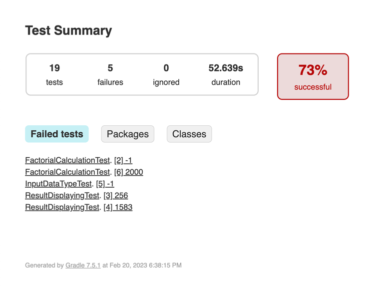

# alfa_selenide

For run use ide or mvn test or GitHub actions

## Results:

### All tests count - 19.
#### Failed - 5 (need to fix bugs)

Tests are split on UI and API to decrease time for run and better understanding root cause of problem